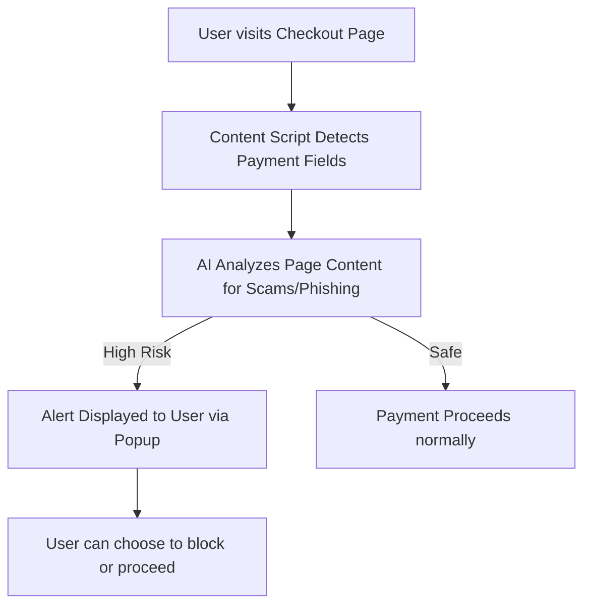

# AI Payment Guardian

AI Payment Guardian is a Chrome extension designed to monitor and protect your online payments using AI.

## Installation Instructions

1. **Download the project** as a ZIP file.
2. **Extract the ZIP file** to a folder on your computer.
3. Open Google Chrome and go to `chrome://extensions/`.
4. Turn on **Developer mode** using the toggle switch in the top right corner.
5. Drag and drop the extracted folder directly into the extensions page, OR click **Load unpacked** and select the folder.
6. The extension is now installed and ready to use!

## Process Flow

## Features
- AI-powered payment monitoring
- Real-time alerts
- Secure and private
